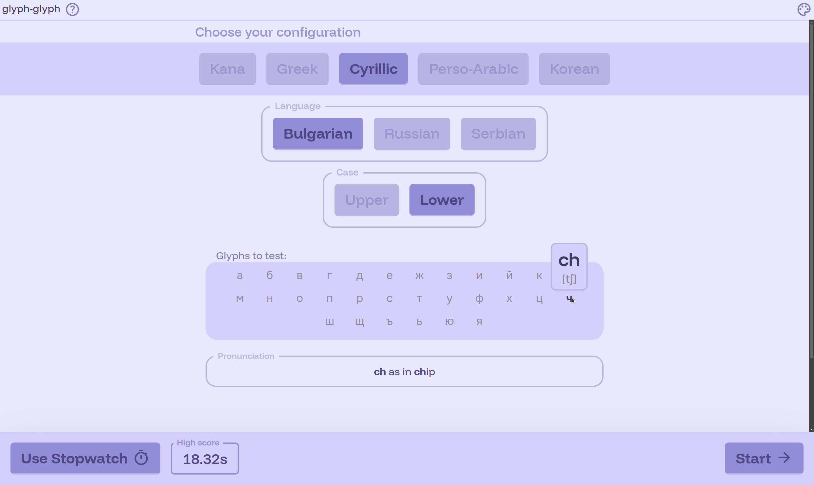
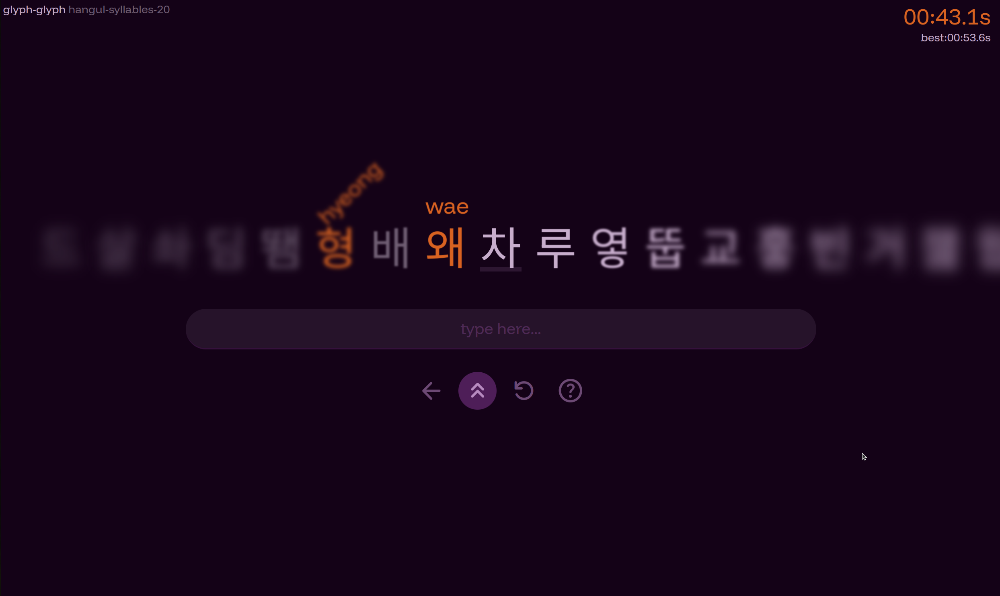
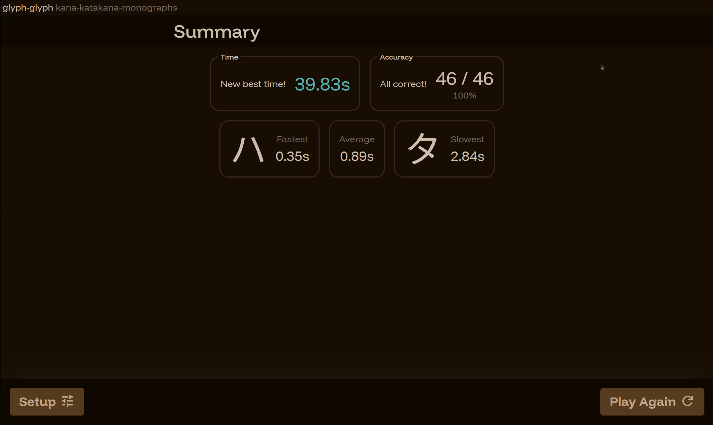
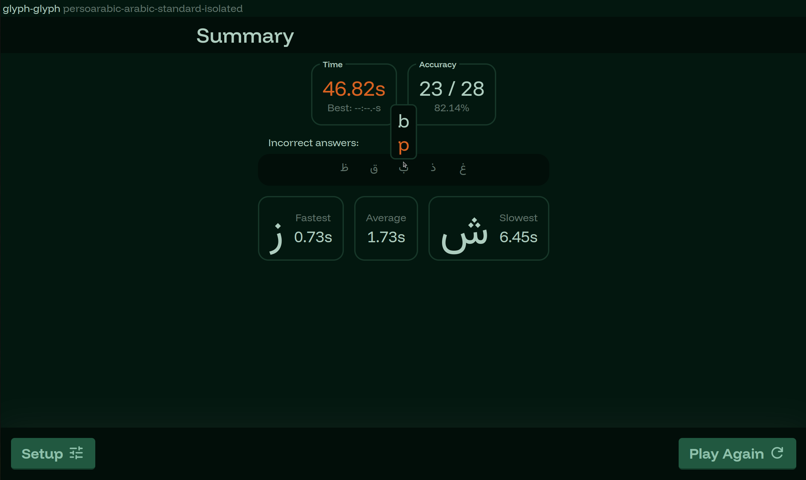

# glyph-glyph

A game to help you learn different writing systems.

### [**_Click here to play_**](https://glyph-glyph.jn3008.com)

The currently available modes are:

#### Kana 🇯🇵 (incl. digraphs and diacritics)

- Katakana
- Hiragana

#### Greek 🇬🇷 (letter names / transcriptions)

#### Cyrillic 🇧🇬🇷🇺🇷🇸

- Bulgarian
- Russian
- Serbian

#### Perso-Arabic 🇸🇦🇮🇷🇵🇰

- Arabic (different regional pronunciations)
- Persian (Farsi)
- Urdu

#### Hangul 🇰🇷 (Korean)

- Vowels
- Consonants
- Random syllables

### 🌟 Want a new alphabet/writing system supported?

You can request a new alphabet or feature by [opening an issue on GitHub](https://github.com/jn3008/glyph-glyph/issues).

## Screenshots

<div align="center">
  Setup <br>
  
  <br><br>Play<br>
  
  <br><br>Summary<br>
  
  <br><br>
  
</div>

## Developing

Install dependencies with `npm install`, start a development server:

```bash
npm run dev
```

## Credit

Some design elements and code was inspired by a similar game for learning japanese characters :
[type-kana.furudean.com](type-kana.furudean.com),
[https://github.com/furudean/type-kana](https://github.com/furudean/type-kana)

and my p5js typing game from 2019: [https://editor.p5js.org/jn3008/full/0NVLg4ABL](https://editor.p5js.org/jn3008/full/0NVLg4ABL)
